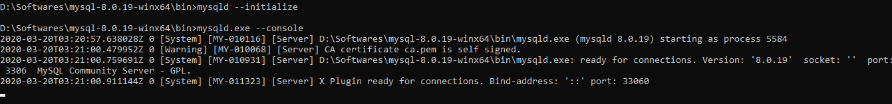

# Hazelcast

Hazelcast is an in-memory caching mechanism provided by the spring boot. Spring boot auto-configures the Hazelcast instance if the hazelcast is available in our application’s classpath and the required configuration is available.

Hazelcast is a radical, new approach towards data that was designed from the ground up around distribution


The overview of application developed as follows


## Features of Hazelcast-

* The data is always stored in-memory (RAM) of the servers.This makes it incredibly fast.
* Multiple copies are stored in multiple machines for automatic data recovery in case of single or multiple server failures. In the event of failure, the overall cluster will not suffer any data loss.
* Major feature of Hazelcast is its masterless nature. Each node is configured to be functionally the same and operates in a peer-to-peer manner.
* The data model is object-oriented and non-relational.
* Servers can be dynamically added or removed to increase the amount of CPU and RAM.
* The data can be persisted from Hazelcast to a relational or NoSQL database.
* A Java Map API accesses the distributed key-value store.

## Setup Database
1. Download the MySQL zip
2. Unzip the downloaded file and open the command line at the unziped location, go to `bin` directory
3. To initialize the MySQL run the below mentioned command, it will create the data directory in the same folder

        mysqld  --initialize-insecure
4. To start the server 

        mysqld.exe --console

    
5. Done with the setup, we can start with the MySQL to start the SQL

        mysql -u root
    
6. Create database 

        CREATE DATABASE hibernate_test;
    
    
7. Create a table name `item`
    ```sql
    CREATE TABLE item(id int NOT NULL, name VARCHAR(20), category VARCHAR(20));
    ```
8. Add the below properties to the application.properties file..

        spring.datasource.url=jdbc:mysql://localhost:3306/hibernate_test
        spring.datasource.username=root

## Dependencies

```xml
<dependency>
  <groupId>com.hazelcast</groupId>
  <artifactId>hazelcast</artifactId>
</dependency>
<dependency>
  <groupId>com.hazelcast</groupId>
  <artifactId>hazelcast-spring</artifactId>
</dependency>
```

## Create Hazelcast Member

To configure Hazelcast, add the code in the main class.

```java
@Bean
	public Config hazelcastConfig() {
		return new Config().setInstanceName("hazelcast-instance")
				.addMapConfig(new MapConfig().setName("itemCache")
						.setMaxSizeConfig(new MaxSizeConfig(300, MaxSizeConfig.MaxSizePolicy.FREE_HEAP_SIZE))
						.setEvictionPolicy(EvictionPolicy.LRU) // LRU (Last Recent Use)
						.setTimeToLiveSeconds(2000));
	}
```
When we start the ServerNode application, we can see the flowing text in the console which means that we create a new Hazelcast node in our JVM which will have to join the cluster.

    Members [1] {
        Member [192.168.1.105]:5701 - 899898be-b8aa-49aa-8d28-40917ccba56c this
    }
To create multiple nodes we can start the multiple instances of ServerNode application. Hazelcast will automatically create and add a new member to the cluster.

For example, if we run the ServerNode application again, we will see the following log in the console which says that there are two members in the cluster.

    Members [2] {
    Member [192.168.1.105]:5701 - 899898be-b8aa-49aa-8d28-40917ccba56c
    Member [192.168.1.105]:5702 - d6b81800-2c78-4055-8a5f-7f5b65d49f30 this
    }

## Endpoints

1. Get
    ```curl
    curl --location --request GET 'localhost:9080/item/1' \
    --header 'Content-Type: application/json'
    ```

    

2. Update Cache

    ```curl
    curl --location --request PUT 'localhost:9080/updateItem' \
    --header 'Content-Type: application/json' \
    --data-raw '{"id":1,"name":"Nokia","category":"Mobile"}'
    ```

3. Delete Single Cache

    ```curl
    curl --location --request DELETE 'localhost:9080/delete/1' \
    --header 'Content-Type: application/json'
    ```

4. Delete All Cache

    ```curl
    curl --location --request DELETE 'localhost:9080/deleteall'
    ```